**`Embedded Systems Developer`**

    

 

 
Computer Engineering student at the Federal University of Ceará. I'm interested in robotics, embedded systems, and assistive technology, Human-Computer Interface, especially Brain-Computer Interface. Currently, all of my projects so far have been for student competitions, so I plan to post them here over time

 

 

    
    
    
    
    

 

 

    
    
    

 

